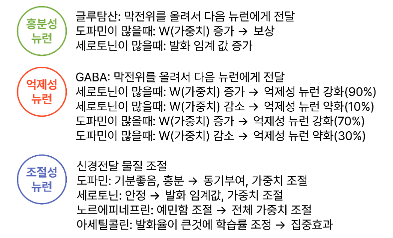
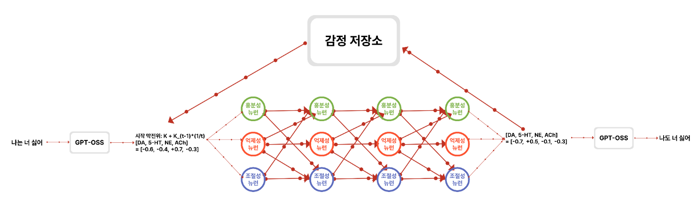
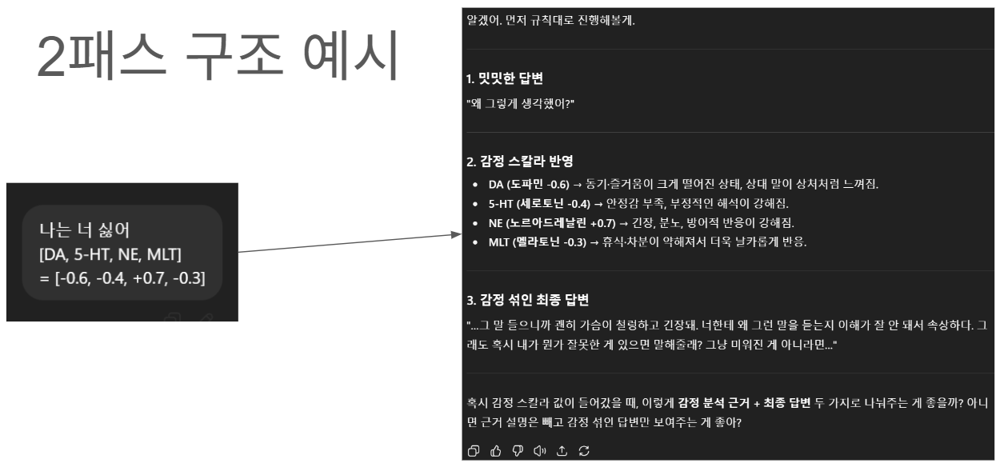

감정을 느끼게 하는게 목표인 인공지능입니다





## NTL 추출 전략

### 근거 및 현재 한계
- **LLM 성능 우수 근거**: 문맥 기반 정서 표현/추론에 강하며, 동일 프롬프트 조건에서 정성 평가 일관성이 높다. (대화 맥락·정서 뉘앙스 반영)
- **ML 성능 한계(≈30%)**: 기존 분류 기반 ML 모델은 정답 분포 편향과 피처 한계로 인해 성능이 약 30% 수준에 머무는 것으로 관측됨.
- **회귀 사용 시 성능 하락 가능성**: 연속값 회귀로 전환 시 레이블 불확실성 및 분산 증가로 인해 일관성/재현율이 떨어질 수 있음.

### 향후 실험 계획
- **앙상블**: LLM+ML 결합(스태킹/보팅)으로 안정성 확보.
- **캐시**: 동일/유사 입력에 대한 캐시 기반 응답 재사용으로 비용 및 변동성 절감.
- **가중 결합**: LLM/ML 결과를 신뢰도·비용에 따라 가중 평균.
- **품질 측정 지표**: 정량(정확도/MAE/상관) + 정성(인간 평가/일관성 체크리스트) 병행.

### 디스커션 필요
- **의사결정 기준**: 데이터셋(도메인/규모/라벨 품질), 평가지표(정량+정성), 비용(추론 비용·지연·인력 라벨링)을 기준으로 전략 확정.
- **결정 포인트**: (1) LLM 단독 vs 하이브리드, (2) 회귀 유지 여부, (3) 캐시/앙상블 적용 범위.

연구 환경 구축 및 모델 선정
오픈소스 GPT 계열 모델(GPT-OSS, LLaMA, Mistral 등) 선정
Python 환경 세팅 (transformers, fastapi/flask, numpy, torch 등)
텍스트 입력–출력 파이프라인 기본 구조 마련
감정 벡터 추출 모듈 구현
입력 문장을 GPT에 전달 → 감정 벡터(도파민, 세로토닌, 노르에피네프린, 아세틸콜린) 4차원으로 변환
감정 신경망 노드 정의 및 구조 설계
억제성/흥분성/조절성 뉴런 노드를 실제 신경전달물질 작용 원리 기반으로 구현
신경전달 물질 선정(계획상 도파민, 세로토닌, 노르에피네프린, 아세틸콜린)
연결 구조 설계
- 각 신경전달물질은 특정 뉴런 집단에 우선 연결(도파민↔흥분성, 세로토닌↔억제성)
- 억제 ↔ 흥분, 조절 ↔ 전체 회로 간 약한 교차 연결 허용
- GPT 감정 벡터와 실시간 동기화
감정 상태 유지 및 감쇠 메커니즘 설계
새로운 입력이 들어와도 이전 감정 상태가 잔향처럼 남아있도록 구현
-> 시간에 따른 점진적 감쇠 적용, 새로운 입력 시 현재 감정과 과거 감정을 가중 평균으로 업데이트
인간 감정 잔향과 유사한 상태 전이 구현
응답 생성 제어 모듈 개발
2패스 구조
-> GPT가 내용중심 초안 생성
-> 생성한 초안과 감정 벡터를 다시 GPT에 입력
통합 시스템 구현 및 시나리오 검증
전체 파이프라인(입력 → 감정 벡터 추출 → 노드 작동 → 상태 유지 → 답변 생성) 통합
긍정·부정·중립 입력 시나리오를 설정하여 감정 변화 및 응답 톤의 일치성 검증


전체 설계 요약
0) 입력→벡터화 (전처리)

IPT(문자열) → emovec_autorun_cls.py

감정코드 분류(LogReg, multinomial, balanced) → 4D 감정벡터 [dopamine, serotonin, norepinephrine, melatonin].

이후 신경망의 입력으로 사용.

1) 데이터 박스 (뉴런 간 이동 단위)
DataBox = { K, V[4], IPT_LIST }
- K: 막전위
- V: 감정 벡터 [D, S, NE, M] (0~1)
- IPT_LIST: (id, text) 리스트. id가 클수록 최신.

2) 네트워크 토폴로지/간선

뉴런들은 시냅스 간선으로 다대다(fan-in/fan-out) 연결.

간선마다 가중치 W 보유(동적 변화 가능).

송신 뉴런은 처리 후 K ← K * W 반영된 DataBox를 각 출력 간선으로 전송.

3) 수신 측 결합 규칙 (여러 입력이 들어올 때)

K: 별도 결합 없음. 송신에서 이미 K*W 적용된 입력 단위별로 처리(패스스루).

감정 벡터 V: 각 성분을 W 가중평균으로 결합

𝑉
𝑐
′
=
∑
𝑖
𝑊
𝑖
⋅
𝑉
𝑖
,
𝑐
∑
𝑖
𝑊
𝑖
,
𝑐
∈
{
𝐷
,
𝑆
,
𝑁
𝐸
,
𝑀
}
V
c
′
	​

=
∑
i
	​

W
i
	​

∑
i
	​

W
i
	​

⋅V
i,c
	​

	​

,c∈{D,S,NE,M}

IPT_LIST: 중복 id 제거 → id 내림차순(최근 우선) 정렬 → (옵션) 상위 N개 유지.

4) 공통 동작 (모든 뉴런)

발화 조건: K > threshold 이면 고유 기능 수행 → (K, V, IPT_LIST) 갱신 후 다음으로 전송.

기억 조건: K > memory_threshold 이면 수신 IPT를 자신의 IPT 스택에 저장(LIFO).

이후 신호 처리 시, 스택에 있던 IPT가 있으면 현재 DataBox.IPT_LIST에 병합.

가중치/구조 가소성: 고유 기능 동안 ΔW 산출.

ΔW > 0 → 주변 뉴런과의 간선 수 증가, ΔW < 0 → 간선 제거 (동적 연결망).

최종 전위 갱신: K ← K * W (송신 직전에 적용).

5) 뉴런 3종의 고유 기능
A. 흥분성 뉴런 (Excitatory)

감정 벡터 극단화: K에 비례해 0.5에서 멀어지도록 증폭.

예: V' = 0.5 + (V - 0.5) * (1 + α·K) (포화형으로 바꿔도 됨)

가중치 조정:

Δ
𝑊
∝
(
𝐷
+
𝑁
𝐸
)
(
도파민, 노르에피네프린 높을수록 
𝑊
↑
)
ΔW∝(D+NE)(도파민, 노르에피네프린 높을수록 W↑)
B. 억제성 뉴런 (Inhibitory)

감정 벡터 평준화: K에 비례해 0.5 쪽으로 수축.

예: V' = 0.5 + (V - 0.5) * (1 - g(K))

확률적 W 조정(감정 상태 의존):

세로토닌↑: W 증가 90%, 감소 10%

도파민↑: W 증가 70%, 감소 30%

C. 조절성 뉴런 (Regulatory)

임계값 조정(세로토닌): 네트워크의 발화 임계값을 S(세로토닌)에 비례해 조절.

S 높을수록 임계값↑(덜 반응), S 낮을수록 임계값↓(민감).

일시적 비활성화(멜라토닌): M(멜라토닌)에 비례해 일부 뉴런 임시 off(드롭아웃류).

각성 토글(노르에피네프린): NE에 비례해 억제성 일부 off, 흥분성 일부 on.

6) 미니 의사코드(프레임·틱 기준)
for tick in time:
  for neuron in topo.order():
    inbox = neuron.incoming_boxes()              # 각 입력 간선에서 DataBox 수신
    if inbox.empty(): continue

    # --- 입력 결합 ---
    K_list, V_list, IPT_lists, W_list = unzip(inbox)
    V_in = weighted_mean(V_list, W_list)         # 성분별 W-가중평균
    IPT_in = merge_unique_desc(IPT_lists)        # id 중복 제거, 내림차순

    # --- 기억/병합 ---
    if any(K > memory_threshold for K in K_list):
        neuron.IPT_stack.push(IPT_in.recent())   # 스택 저장
    IPT_merged = merge_unique_desc([IPT_in, neuron.IPT_stack.peek_all()])

    # --- 발화 판단 & 고유 기능 ---
    for (K_i, V_i, W_i) in inbox:                # K는 입력별 독립 처리
      if K_i <= neuron.threshold: continue

      (K_o, V_o, ΔW) = neuron.specific_op(K_i, V_in, IPT_merged)

      # --- 가소성/구조변화 ---
      neuron.W += ΔW
      if ΔW > 0: neuron.add_edges(proportional_to=ΔW)
      if ΔW < 0: neuron.remove_edges(proportional_to=-ΔW)

      # --- 최종 전위 갱신 & 송신 ---
      K_o = K_o * neuron.W
      neuron.send_to_outputs(DataBox{K_o, V_o, IPT_merged})


(specific_op는 뉴런 종류별 규칙: 흥분성=극단화(+D·NE로 ΔW↑), 억제성=평준화(+S/ D 기반 확률적 ΔW), 조절성=S로 임계값 조정 + M 드롭아웃 + NE 토글)

7) 구현 체크리스트

 DataBox 구조체 정의, IPT ID 정책 및 최대 보관 N.

 뉴런 베이스 클래스(공통 로직) + 3종 파생 클래스(specific_op/ΔW 규칙).

 W-가중평균 벡터 결합 유틸.

 동적 간선 추가/제거 정책(최소/최대 차수, 안정화용 클램핑).

 임계값 스케줄러(조절성 뉴런이 갱신할 글로벌/지역 임계값).

 멜라토닌·NE 기반 토글의 비율 함수와 지속 시간(틱 수) 파라미터.

 emovec_autorun_cls.py와의 I/O 인터페이스(IPT→V[4]) 훅.

필요하면 이걸 그대로 클래스 다이어그램/코드 스켈레톤으로 빼줄게. 지금 흐름은 잘 잡혔고, 다음은 수치 함수(α, g(K) 등)와 포화/클램프 범위만 고르면 바로 시뮬 돌릴 수 있어.

---
# 버전별 상세 정리 (특징/아이디어/개선점)
아래 정리는 각 버전 폴더의 **실제 코드/노트북/데이터**를 바탕으로 정리한 것입니다.  
버전 간 공통 목표는 “텍스트 → 감정(신경전달물질) → 신경망 동역학 → 출력/프롬프트 생성”입니다.

---
## ver.alpha (초기 데이터/스파이크 기반 시도)
### 1) 핵심 특징
- **스파이크 기반 파이프라인**: 텍스트를 임베딩 → 뉴로모듈레이터(DA/5HT/NE/ACh 등) 시드와의 유사도 → softmax 점수 → 발화율(λ)로 변환 → 포아송 스파이크 생성 흐름.  
- **강화학습 기반 파라미터 보정**: reward 기반으로 α/β를 업데이트하는 REINFORCE가 포함되어 있음.  
- **NLG 요약 보조**: 요약 LLM이 있으면 한 문장 감정 요약을 생성하고, 없으면 룰 기반 요약 사용.

### 2) 포함 데이터/자산
- **emotion_dataset.txt**: 발화 ↔ 이모지/기호(반응) 쌍 형태의 라벨링 데이터.  
- **emotion_dataset_contextual.txt**: (이전 두 문맥 + 현재 발화) ↔ 반응 형태의 컨텍스트 데이터.  
- **ver.alpha/ver.2**: 카카오톡 대화 로그 원문(원본 대화 흐름).

### 3) 아이디어 요약
- “언어적 의미”를 바로 **뉴로모듈레이터 스파이크로 변환**하는 신경과학적 접근.  
- 감정이 “연속값”이 아니라 “스파이크 활동”으로 표상된다는 가정.  
- 감정 요약을 텍스트로도 되돌려서 해석 가능성을 확보.

### 4) 개선점 (구체)
- **임베딩-시드 매핑의 품질**: 시드 문구 설계가 전체 성능에 크게 영향 → 시드 문구 다양화 및 재학습 필요.  
- **λ 변환의 안정성**: alpha/beta의 범위가 넓어질 수 있어 안정적 클리핑/스케줄링 필요.  
- **스파이크 해석 레이어**: 스파이크를 최종 감정 벡터/응답 톤으로 연결하는 명확한 규칙 추가 필요.

### 5) 처음 보는 사람용 빠른 실행
- **스파이크 파이프라인 데모**
  1. Python 환경에서 아래 실행:
     ```
     python ver.alpha/ver.1/single_file_emotion_spike.py
     ```
  2. 출력되는 Stats/요약을 확인해 스파이크 생성 흐름을 검증.
- **데이터 확인(샘플 보기)**
  1. 감정 데이터는 `ver.alpha/emotion_dataset.txt`,  
     문맥 포함 데이터는 `ver.alpha/emotion_dataset_contextual.txt`를 열어 확인.

---
## ver.beta (LLM 감정 벡터 + 뉴런 모델링 + 2패스 응답)
### 1) 핵심 특징
- **LLM 기반 감정 벡터 추출**: GPT-OSS-20B를 통해 dopamine/serotonin/norepinephrine/melatonin 4축 스코어를 JSON으로 얻음.  
- **흥분/억제/조절 뉴런 모델링**: Excitatory/Inhibitory/Modulatory 뉴런 클래스가 분리되어 있음.  
- **EmotionStore**: 감정 상태를 누적하고 시간 감쇠를 적용하는 저장소 역할.  
- **2패스 응답 제어**: 1패스(내용 중심 초안) → 2패스(감정 스타일 재작성) 구조.

### 2) 아이디어 요약
- **감정 벡터를 스타일 파라미터로 변환**하여 “문장 톤”을 제어하는 실용적 접근.  
- 감정 벡터가 뉴런 모델을 거쳐 **스토어(기억)로 축적**되어 누적 감정 상태를 생성.

### 3) 개선점 (구체)
- **EmotionStore.start_potential 등 누락 메서드**: 일부 의존성이 불완전 → 스토어/뉴런 간 인터페이스 정리 필요.  
- **LLM 비용/속도**: 매 턴 JSON 추출이 비싼 구조 → 캐싱/경량 모델/로컬 분류기 대체 옵션 마련 필요.  
- **2패스 통제 강화**: 스타일 파라미터와 실제 출력의 상관을 더 정량적으로 검증하는 실험 필요.

### 4) 처음 보는 사람용 빠른 실행
- **노트북/스크립트 실행 방식**
  1. `ver.beta/# %% [markdown].py` 파일은 노트북 셀을 합친 형태입니다.
  2. LLM 사용 가능 환경(GPU/모델)에서 다음을 순서대로 실행:
     - 모델 로딩 → `emotion_vector` → 뉴런 테스트 → ChatController.
  3. CLI 흐름은 `/help` 명령으로 안내됨.

---
## ver.gamma (프로토타입 SNN 구조 실험)
### 1) 핵심 특징
- **LLM → NTL(신경전달물질 코드) 가정**을 둔 뼈대 구현.  
- 감정 저장소(emotion_storage), 뉴런(neuron), 네트워크 노드 분할 구조가 초기 형태로 존재.
- 3.1.2에서는 LLM 스코어 파서가 개선되어 **JSON 파싱 안정성**이 강화됨.

### 2) 아이디어 요약
- 감정(NTL)을 **K(막전위)**와 결합해 네트워크를 흐르게 한다는 초기 설계.  
- 뉴런 연결 추가/제거가 가능한 구조를 통해 **동적 가소성**을 실험.

### 3) 개선점 (구체)
- **메서드 미완성 영역**(do_work 등): 핵심 연산 로직이 비어 있음 → 실제 연산 정의 필요.  
- **NTL/K 업데이트 안정성**: 감쇠/누적 방식이 수학적으로 불안정할 수 있음 → 클리핑/스케일링 필요.  
- **LLM 의존성**: 감정 코드 추정이 모델 출력에 과도하게 의존 → 대체 규칙 또는 분류기 필요.

### 4) 처음 보는 사람용 빠른 실행
- **노트북에서 구조 확인**
  1. `ver.gamma/3.1.1/main.ipynb` 또는 `ver.gamma/3.1.2/main.ipynb`를 열어 셀 순서대로 실행.
  2. FLOW 섹션에서 입력 → 감정 저장소 → 뉴런 자극 흐름을 따라가며 구조 이해.

---
## ver.delta (감정 분류/벡터 매핑 실험)
### 1) 핵심 특징
- **TF-IDF + Logistic Regression** 기반 감정 코드 분류.  
- 감정 코드(E10~E69 등)를 **4D 감정 벡터**로 매핑.  
- 학습 결과(accuracy, macro-F1, MAE)를 리포트로 저장.

### 2) 아이디어 요약
- LLM 대신 **전통적 분류기**로 감정 벡터를 추출하는 경량화 시도.  
- 벡터 매핑을 통해 **SNN 입력**으로 곧바로 연결 가능한 구조.

### 3) 개선점 (구체)
- **데이터 라벨 품질/불균형 문제**: 감정 코드 분포 편향 가능 → 샘플링/가중치 전략 필요.  
- **특징 추출 한계**: char_wb ngram 중심 → 의미 기반 문맥 파악 부족 → 임베딩 기반 분류기 도입 고려.  
- **모델 성능 지표 활용**: 정확도/MAE를 기준으로 벡터 매핑 개선 반복 필요.

### 4) 처음 보는 사람용 빠른 실행
- **노트북 실행**
  1. `ver.delta/4.1.1/main.ipynb`를 열고 셀을 순서대로 실행.
  2. 상단 출력 리포트에서 정확도/MAE 확인.

---
## ver.epsilon (SNN 구조 정리 + 분류기 분리)
### 1) 핵심 특징
- **SNN 규칙의 명료화**: 입력 결합/메모리/트레이스/가중 평균 등이 코드로 잘 구조화됨.  
- **Neuron 종류별 동작**: excitatory/inhibitory/regulatory가 분리되고 조절 뉴런이 글로벌 임계값과 dropout/NE 토글을 적용.  
- **분류기 분리**: emovec_autorun_cls.py로 텍스트 분류기만 따로 구성.

### 2) 아이디어 요약
- SNN을 **규칙 기반으로 단순/명시적으로 정의**하여 디버깅과 튜닝을 용이하게 함.  
- 감정 벡터 분류기를 별도 모듈로 분리해 **교체 가능성**을 확보.

### 3) 개선점 (구체)
- **Regulatory 뉴런 효과 검증**: threshold/ dropout/ toggle의 실제 감정 변화 효과를 정량화해야 함.  
- **입력 벡터 품질**: ipt_to_vec4_stub은 임시 난수 → 반드시 분류기 연동 필요.  
- **경로 도착 조건**: terminal inbox 확인 기반 도착 로직이 단순 → 보다 안정적인 종료 기준 필요.

### 4) 처음 보는 사람용 빠른 실행
- **SNN 데모 실행**
  1. 아래 실행:
     ```
     python ver.epsilon/main.py
     ```
  2. 출력되는 topology/trace 로그로 네트워크 동작 확인.
- **감정 분류기 학습 실행**
  1. 아래 실행:
     ```
     python ver.epsilon/emovec_autorun_cls.py
     ```
  2. 리포트 JSON과 모델 파일이 `emovec_autorun_cls_out/`에 생성됨.

---
## ver.eta (다양한 변형/드라마틱/시각화 실험)
### 1) 핵심 특징
- **수동 감정 입력 브릿지**: 사용자가 외부 LLM 결과를 직접 입력.  
- **드라마틱 모드**: 감정 변화를 크게 만드는 mix_emotions, 직설적 말투 지시문 강화.  
- **시각화/로그**: matplotlib 기반 감정 변화 그래프, 활성 뉴런 흐름, CSV 로그 저장까지 포함.

### 2) 아이디어 요약
- 감정 출력의 “극단성”을 의도적으로 키워, 사용자 체감이 강한 반응을 목표로 한 버전.  
- 로그/시각화를 통해 **감정 변화 추적 가능성**을 확보.

### 3) 개선점 (구체)
- **과도한 감정 증폭**: 드라마틱 모드가 실제 대화에서는 과장될 수 있음 → 강도 조절 파라미터 필요.  
- **입력 신뢰성**: 수동 입력 방식은 일관성 부족 → 자동 분류/검증 로직 추가 필요.  
- **시각화 분리**: 시뮬레이션과 시각화가 한 루프에 결합 → 모듈 분리 및 성능 개선 필요.

### 4) 처음 보는 사람용 빠른 실행
- **드라마틱 모드 실행**
  1. 아래 실행:
     ```
     python "ver.eta/main_뒤끝있는 버전.py"
     ```
  2. 안내된 프롬프트에 따라 LLM 결과를 수동 입력.
- **기억 없는 버전 실행**
  1. 아래 실행:
     ```
     python "ver.eta/main_기억 없는 버전_성공!.py"
     ```
  2. 키워드 기반 감정 추출과 프롬프트 생성을 확인.

---
## ver.zeta (통합 강화 + 최근 수동 입력 중심)
### 1) 핵심 특징
- **MANUAL BRIDGE**: 외부 LLM이 만든 감정 벡터를 직접 입력 → SNN 처리 → 페르소나 프롬프트 생성.  
- **통합형(감정_잘됨.py)**: 감정 분류(ML) + SNN + 도파민 쉴드 + 실시간 시각화가 하나의 파일에 통합.

### 2) 아이디어 요약
- **모듈 통합**을 통해 “입력 → 분류 → 벡터 → SNN → 시각화”를 한 번에 확인.  
- 도파민 쉴드로 **억제성 뉴런의 과도한 평준화**를 방지.

### 3) 개선점 (구체)
- **코드 규모와 복잡도**: 통합형 파일이 커서 유지보수 어려움 → 모듈 분리 필요.  
- **하드코딩 보정 로직**: 특정 문장에 강제 벡터 주입 등 테스트 로직이 혼재 → 실전/테스트 분리 필요.  
- **의존성 관리**: ML/시각화 의존성이 많아 실행 환경 세팅 어려움 → requirements 문서화 필요.

### 4) 처음 보는 사람용 빠른 실행
- **Manual Bridge 실행**
  1. 아래 실행:
     ```
     python "ver. zeta/main.py"
     ```
  2. 외부 LLM에서 받은 4D 벡터를 입력하여 프롬프트 생성 확인.
- **통합형(시각화 포함) 실행**
  1. 아래 실행:
     ```
     python "ver. zeta/감정_잘됨.py"
     ```
  2. 분류기 학습 → SNN → 시각화 출력 확인.

---
# 버전별 발전 흐름 요약
1. **alpha**: 스파이크·임베딩 기반 감정 해석이라는 과감한 실험.  
2. **beta**: LLM 감정 벡터 + 뉴런 모델링 + 2패스 응답 제어로 “사용 가능한 구조” 탐색.  
3. **gamma**: SNN 프로토타입 기반 설계/구조 정리.  
4. **delta**: LLM 대신 전통 분류기 기반 감정 벡터 추출 실험.  
5. **epsilon**: SNN 규칙을 코드로 정리하고 분류기 분리를 시도.  
6. **eta**: 감정 증폭/시각화/로그 등 “체감형 데모” 강화.  
7. **zeta**: 감정 분류 + SNN + 시각화를 통합한 최신 버전.

---
# 향후 개선 로드맵 (공통 제안)
1. **감정 벡터 품질 보강**  
   - LLM/분류기 병렬 사용 → 가중 평균 또는 신뢰도 기반 혼합.  
2. **SNN 출력의 안정성 확보**  
   - threshold, decay, weight update 파라미터를 체계적으로 튜닝.  
3. **프롬프트 제어 검증**  
   - 감정 벡터와 출력 스타일의 상관을 정량화한 실험 설계 필요.  
4. **모듈화/경량화**  
   - 감정 분류, SNN, 시각화, 프롬프트 생성 모듈을 분리해 유지보수 개선.  
5. **데이터 확장**  
   - 감정 레이블/맥락/응답 데이터를 확장하여 학습 기반 접근을 강화.
